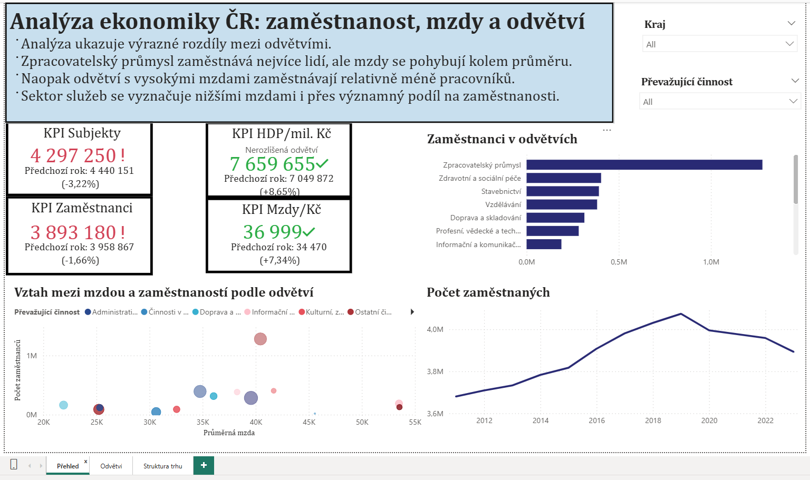

# Czech Industrial & Economic Analysis

In this project, I work with publicly available data from the Czech Statistical Office focused on industrial and economic development in the Czech Republic.

The dataset combines multiple indicators across several years, including GDP, wages, employment and the number of economic entities.

I wanted to practice working with real-world economic data and go through the full process – from raw data to a final analytical output.

## Working with data

The original data required extensive cleaning and transformation, as the source files were inconsistent and difficult to work with.

- Cleaning and transforming data in Python (Pandas)
- Combining multiple datasets into a unified structure (Jupyter Notebook)  
- Preparing final datasets for further analysis and visualization (Power BI)  
- Creating dimension tables (industry, region, year)  
- Designing and implementing a data model (fact + dimension)  
- Creating basic DAX measures

## Dashboard

In Power BI, I created an interactive dashboard structured into several sections:

1. Economic overview
- key KPI indicators (GDP, wages, employment, number of entities)
- overall employment trend over time
- basic relationship between wages and employment
2. Industry comparison
- development of average wages and employment by industry
- comparison of top industries by wages and employment
- analysis of employees per company (company size)
3. Market structure
- distribution of economic entities across industries
- trend in the number of companies over time
- relationship between number of companies and employment

The dashboard allows filtering by year, region, and industry, enabling more detailed exploration of specific segments.

## Insights
- There are significant differences between industries, not only in wage levels, but also in employment structure
- Manufacturing employs the largest number of people, but wages are close to the average
- High-wage industries (e.g. finance or ICT) tend to employ fewer people
- Mining is characterized by a smaller number of large companies with large number of people
- Market structure varies significantly – some industries consist of many small companies, while others are dominated by larger enterprises
## Open questions
Which industries show the strongest long-term growth trends in employment and wages? 
Is there a relationship between the number of companies in an industry and its average wage level?
Are there industries where employment is growing but wages are stagnating?
